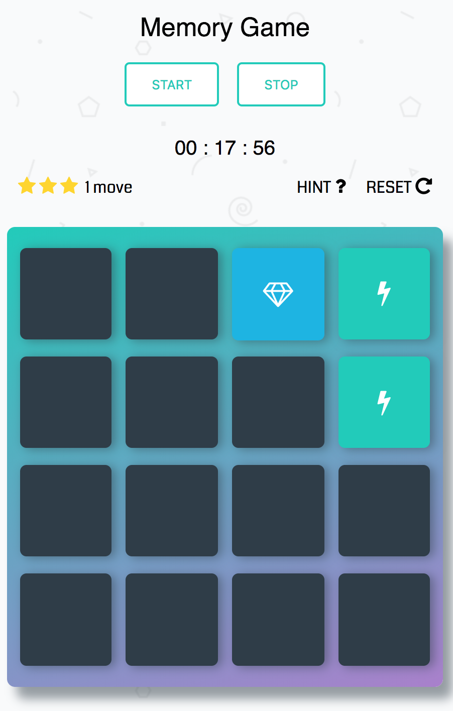

# Memory Game
This is the project for Udacity's [ Front-End Web Developer](https://www.udacity.com/course/front-end-web-developer-nanodegree--nd001) Nanodegree Program. It was developed using HTMl, CSS, and JavaScript. It focuses on DOM manipulation and object-oriented programming.

To play the game, [Click Here!](https://priceless-ptolemy-9a4a35.netlify.com/)  

## Project Overview

Memory Game is a complete browser-based card matching game (also known as Concentration).
The game board consists of sixteen "cards" arranged in a grid. The deck is made up of eight different pairs of cards, each with different symbols on one side. The cards are arranged randomly on the grid with the symbol face down. The gameplay rules are very simple: flip over two hidden cards at a time to locate the ones that match!


###  How the Game Works
- Each turn:

  - The player flips one card over to reveal its underlying symbol.
  - The player then turns over a second card, trying to find the corresponding card with the same symbol.
  - If the cards match, both cards stay flipped over.
  - If the cards do not match, both cards are flipped face down.
  - The game ends once all cards have been correctly matched.

## Installation

- Download or clone the repository
```
  git clone git@github.com:ShaggyT/Memory-Game.git
```

###  Screenshots




